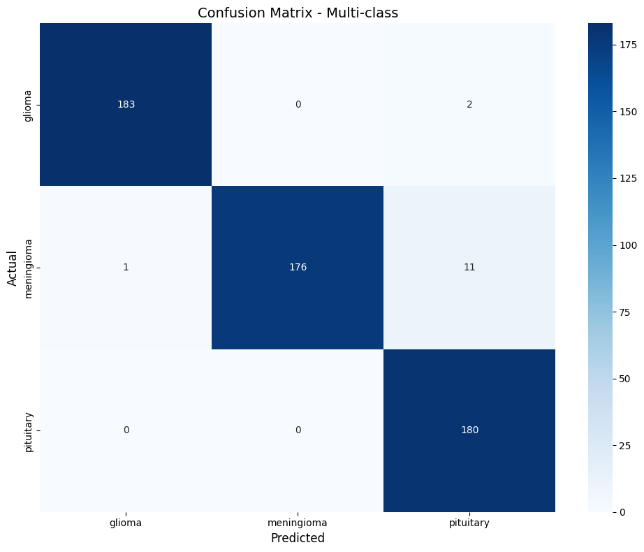

# 🧠 Brain Tumor Classification & Visualization

An AI-powered medical imaging application for Brain MRI analysis using Attention-Enhanced ResNet50 and Explainable AI (Grad-CAM).

The system provides both:

- Binary Classification (Tumor / No Tumor)
- Multi-Class Classification (Glioma, Meningioma, Pituitary)

through an interactive Streamlit dashboard designed for medical image exploration and model interpretability.

---

## 🚀 Features

### 🔍 Brain MRI Classification

Detects brain tumors from MRI scans using deep learning.

Supported tasks:

- Binary Classification
  - Tumor
  - No Tumor

- Multi-Class Classification
  - Glioma
  - Meningioma
  - Pituitary

---

### 🧠 Attention-Enhanced ResNet50

The classification model is built upon a fine-tuned ResNet50 backbone combined with an attention mechanism to improve feature selection and tumor discrimination.

<p align="center">
  
</p>

---

### 🔥 Explainable AI with Grad-CAM

Medical AI systems require transparency.

Grad-CAM visualization highlights the regions that contributed most to the model's prediction, helping users understand model decisions.

<p align="center">
  
</p>

---

## 🏗️ Model Architecture

### Binary Classification Model

<p align="center">
  
</p>

---

### Multi-Class Classification Model

<p align="center">
  
</p>

---

## 📊 Performance

### Binary Classification Accuracy

<p align="center">
  
</p>

---

### Multi-Class Classification Accuracy

<p align="center">
  
</p>

---

### Confusion Matrix

<p align="center">
  
</p>

---

## 🖥️ Interactive Dashboard

The Streamlit application provides:

- MRI Image Upload
- Real-Time Prediction
- Confidence Scores
- Grad-CAM Visualization
- Tumor Analysis Dashboard
- Interactive User Interface

<p align="center">
  
</p>

---

## 📂 Project Structure

```text
Brain-Tumor-Classification-Visualization
│
├── app.py
├── requirements.txt
├── README.md
│
├── figs/
│   ├── models.png
│   ├── binary_model.png
│   ├── multi_model.png
│   ├── gradCAM.png
│   ├── acc_binary.png
│   ├── acc_multi.png
│   └── cm_binary.png
│
└── samples/
    ├── Glioma MRI
    ├── Meningioma MRI
    ├── Pituitary MRI
    └── No Tumor MRI
```

---

## ⚙️ Installation

Clone the repository:

```bash
git clone https://github.com/mahmoudshoip94/Brain-Tumor-Classification-Visualization.git
```

Move into the project directory:

```bash
cd Brain-Tumor-Classification-Visualization
```

Install dependencies:

```bash
pip install -r requirements.txt
```

Run Streamlit:

```bash
streamlit run app.py
```

---

## 🧪 Example MRI Samples

The repository contains example MRI scans for testing and demonstration purposes inside the `samples/` directory.

---

## 🔬 Technologies Used

- Python
- TensorFlow
- Keras
- ResNet50
- OpenCV
- NumPy
- Pandas
- Matplotlib
- Streamlit
- Grad-CAM

---

## 🎯 Future Improvements

- Vision Transformers (ViT)
- Grad-CAM++
- SHAP Explainability
- Tumor Segmentation
- Clinical Report Generation
- Cloud Deployment

---

## 👨‍💻 Author

Mahmoud Shoip

GitHub:
https://github.com/mahmoudshoip94

---

## ⭐ Support

If you found this project useful, consider giving it a star.
