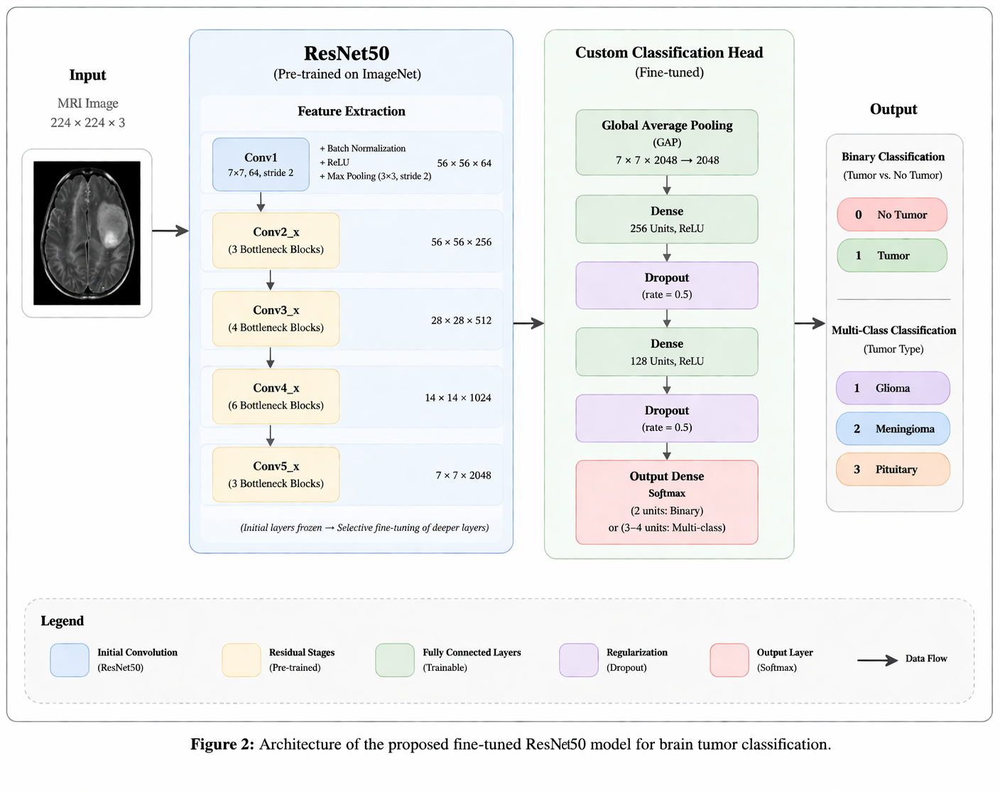
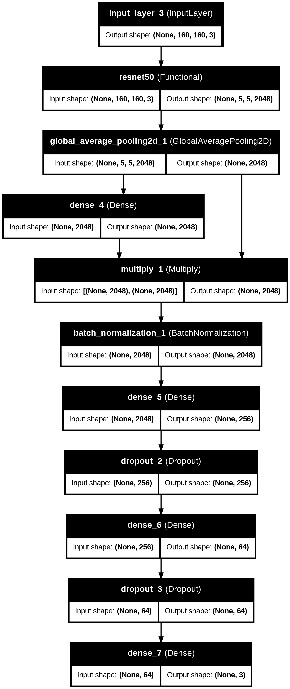
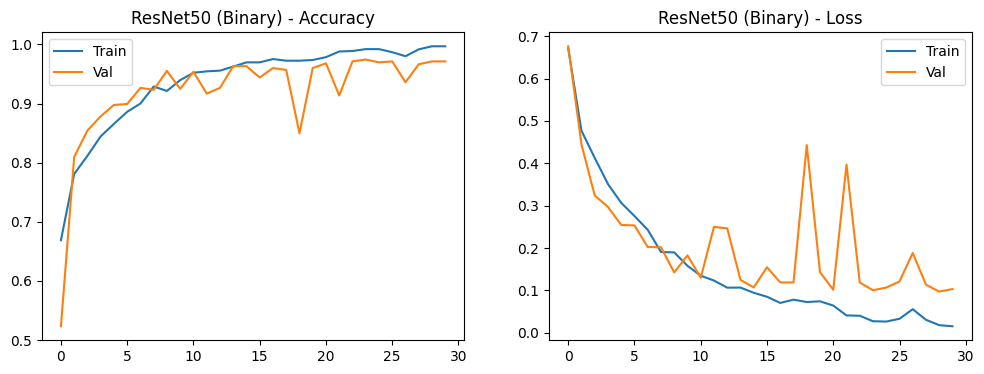
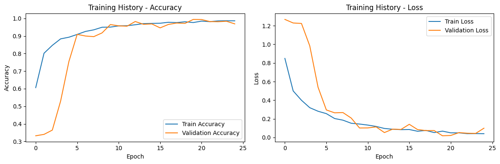
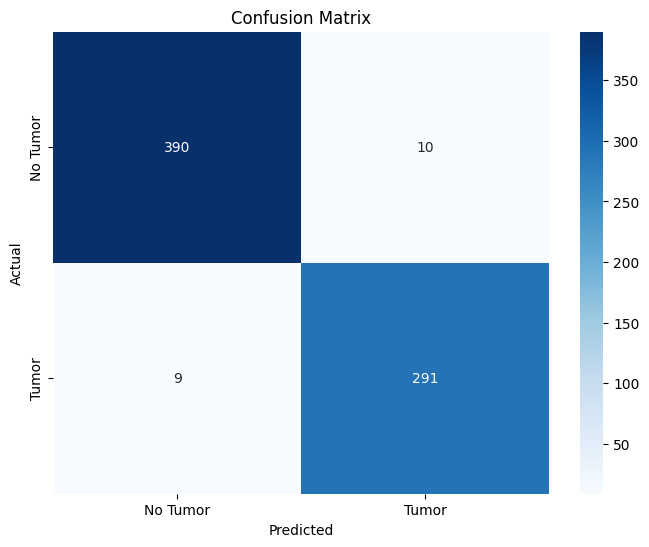
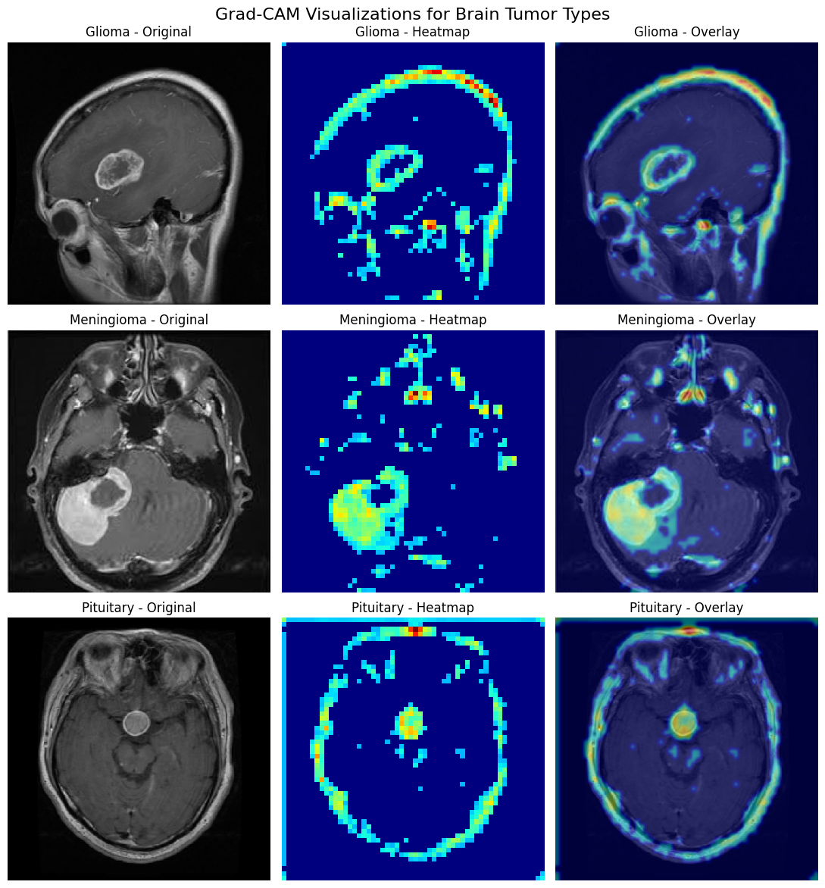
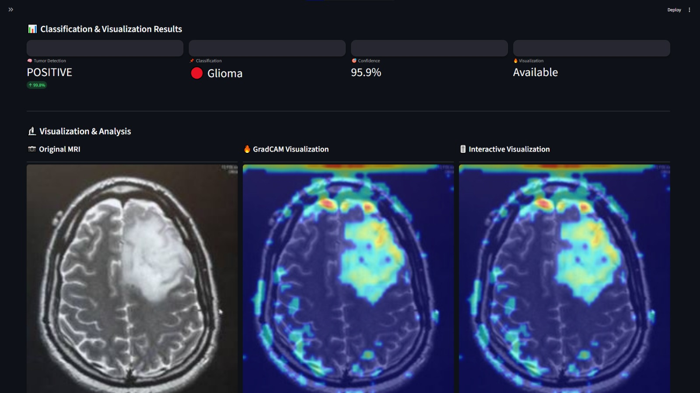
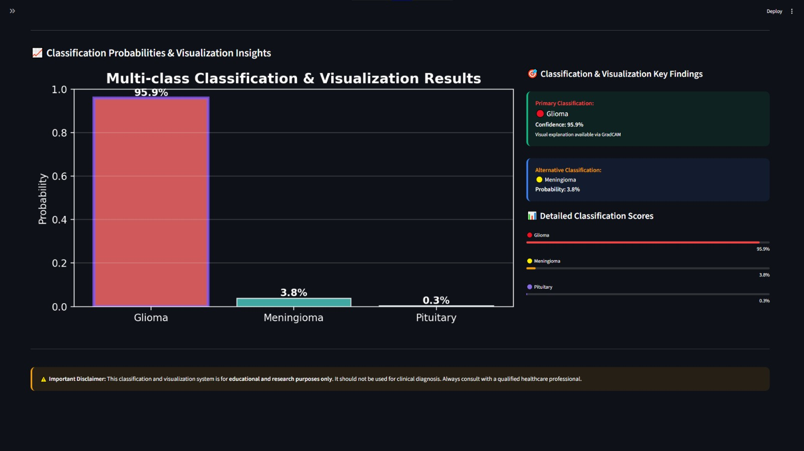

# 🧠 Brain Tumor Classification & Visualization

<div align="center">

# AI-Powered Brain MRI Analysis using Attention-Enhanced ResNet50 and Explainable AI

### Accurate • Explainable • Research-Oriented Medical Imaging System


### 🎯 Key Results

| Task                       | Accuracy   |
| -------------------------- | ---------- |
| Binary Classification      | **97.29%** |
| Multi-Class Classification | **97.47%** |

**Outperformed the Hybrid RDXNet Architecture while reducing model complexity by more than 50%.**

</div>

---

# 📖 Overview

Brain tumor diagnosis from MRI scans is a challenging task that requires significant expertise and time from radiologists.

This project presents a deep learning-based medical imaging system capable of automatically classifying brain MRI scans using an Attention-Enhanced ResNet50 architecture combined with Explainable AI techniques.

The system provides:

* Binary Brain Tumor Classification
* Multi-Class Tumor Classification
* Confidence-Based Predictions
* Visual Explanations through Grad-CAM
* Interactive Streamlit Dashboard

The goal is to improve diagnostic support while maintaining transparency and interpretability.

---

# 🚀 Features

## 🔍 Brain MRI Classification

### Binary Classification

Detects whether an MRI scan contains a brain tumor.

Classes:

* Tumor
* No Tumor

---

### 🧠 Multi-Class Classification

Identifies the tumor category among:

* Glioma
* Meningioma
* Pituitary Tumor

---

### 🎯 Attention-Enhanced ResNet50

The proposed model is built upon a fine-tuned ResNet50 backbone integrated with an Attention Mechanism to improve feature selection and tumor localization.

Benefits:

* Better feature representation
* Improved classification performance
* Enhanced robustness against irrelevant image regions

---

### 🔥 Explainable AI with Grad-CAM

Medical AI systems require transparency.

Grad-CAM is used to visualize the image regions that contribute most to model predictions.

This allows users to:

* Understand model decisions
* Verify tumor localization
* Increase trust in AI predictions

---

# 🏗️ System Pipeline

```text
MRI Image
    │
    ▼
Image Preprocessing
(Resize + Normalization)
    │
    ▼
Data Augmentation
    │
    ▼
Attention-Enhanced ResNet50
    │
    ▼
Classification Layer
    │
    ├── Binary Classification
    │
    └── Multi-Class Classification
    │
    ▼
Grad-CAM Explainability
    │
    ▼
Interactive Dashboard Output
```

---

# 🧬 Model Architecture

## Attention-Enhanced ResNet50

<p align="center">
  
</p>

---

## Binary Classification Model

<p align="center">
  
</p>

---

## Multi-Class Classification Model

<p align="center">
  
</p>

---

# 📊 Dataset

The dataset was assembled from multiple publicly available Brain MRI repositories.

| Source   | Description                    |
| -------- | ------------------------------ |
| Figshare | Brain Tumor MRI Dataset        |
| Kaggle   | Brain Tumor Classification MRI |
| Kaggle   | Brain Tumor Detection          |

### Dataset Links

* https://figshare.com/articles/dataset/brain_tumor_dataset/1512427
* https://www.kaggle.com/datasets/sartajbhuvaji/brain-tumor-classification-mri
* https://www.kaggle.com/datasets/ahmedhamada0/brain-tumor-detection

### Dataset Statistics

| Class      | Images   |
| ---------- | -------- |
| Glioma     | 1321     |
| Meningioma | 1339     |
| Pituitary  | 1457     |
| No Tumor   | 1595     |
| **Total**  | **7023** |

---

# ⚙️ Training Configuration

| Parameter         | Value     |
| ----------------- | --------- |
| Backbone          | ResNet50  |
| Optimizer         | Adam      |
| Learning Rate     | 1e-4      |
| Batch Size        | 16        |
| Epochs            | 30        |
| Input Size        | 224 × 224 |
| Transfer Learning | Yes       |
| Early Stopping    | Yes       |
| ReduceLROnPlateau | Yes       |

---

# 📈 Performance

## Binary Classification Results

| Metric    | Score  |
| --------- | ------ |
| Accuracy  | 97.29% |
| Precision | 97.1%  |
| Recall    | 97.5%  |
| F1-Score  | 97.3%  |

<p align="center">
  
</p>

---

## Multi-Class Classification Results

| Metric    | Score  |
| --------- | ------ |
| Accuracy  | 97.47% |
| Precision | 97.3%  |
| Recall    | 97.7%  |
| F1-Score  | 97.3%  |

<p align="center">
  
</p>

---

# 🎯 Confusion Matrix

## Binary Classification

<p align="center">
  
</p>

---

## Multi-Class Classification

<p align="center">
  
</p>

---

# 🔬 Explainability Results

## Grad-CAM Visualization

Grad-CAM highlights the regions that contributed most to the prediction.

<p align="center">
  
</p>

The generated heatmaps demonstrate that the model focuses on clinically relevant tumor regions rather than surrounding anatomical structures.

---

# ⚔️ Comparison with RDXNet

| Model                       | Accuracy   | Parameters | Model Size  |
| --------------------------- | ---------- | ---------- | ----------- |
| RDXNet                      | 94.00%     | 55.54M     | 211.5 MB    |
| Proposed Attention ResNet50 | **97.47%** | **25.6M**  | **97.7 MB** |

### Improvements

✅ +3.47% Accuracy Gain

✅ 54% Smaller Model Size

✅ Fewer Parameters

✅ Faster Deployment Potential

---

# 🖥️ Interactive Dashboard

The Streamlit application provides:

* MRI Image Upload
* Real-Time Prediction
* Confidence Scores
* Grad-CAM Visualization
* Tumor Analysis Dashboard
* Interactive User Interface

<p align="center">
  
  
</p>


---

# 📂 Project Structure

```text
Brain-Tumor-Classification-Visualization
│
├── app.py
├── requirements.txt
├── README.md
│
├── figs/
│   ├── models.png
│   ├── binary_model.png
│   ├── multi_model.png
│   ├── gradCAM.png
│   ├── acc_binary.png
│   ├── acc_multi.png
│   ├── cm_binary.png
│   └── cm_multi.png
│
└── samples/
    ├── Glioma MRI
    ├── Meningioma MRI
    ├── Pituitary MRI
    └── No Tumor MRI
```
---
---

# 🛠️ Installation

Clone the repository:

```bash
git clone https://github.com/mahmoudshoip94/Brain-Tumor-Classification-Visualization.git
```

Move into the project directory:

```bash
cd Brain-Tumor-Classification-Visualization
```

Install dependencies:

```bash
pip install -r requirements.txt
```

Run the application:

```bash
streamlit run app.py
```

---

# 🧪 Sample MRI Images

Example MRI scans are available in the `samples/` directory for quick testing and experimentation.

---

# 🔬 Technologies Used

* Python
* TensorFlow
* Keras
* ResNet50
* Attention Mechanism
* OpenCV
* NumPy
* Pandas
* Matplotlib
* Streamlit
* Grad-CAM

---

# 🎓 Academic Context

This project was developed as part of a university research-oriented medical imaging project focused on brain tumor classification using deep learning and explainable AI techniques.

The work includes a comparative study against the state-of-the-art RDXNet architecture and demonstrates that a carefully optimized single architecture can outperform more complex hybrid models.

---

# 🚀 Future Work

* Vision Transformers (ViT)
* Grad-CAM++
* SHAP Explainability
* Tumor Segmentation
* Clinical Report Generation
* Docker Deployment
* Cloud Deployment
* Edge Device Optimization

---

# 👥 Team

* [Mahmoud Shoaib](https://github.com/mahmoudshoip94)
* Malak Abd Al-Hamid
* [Abrar Samir](https://github.com/samirabrar320-source)
* Salwa Hesham
* Manal Hany


---

# ⭐ Support

If you found this project useful, consider giving it a star.

It helps support future development and research efforts.

Abozena Added